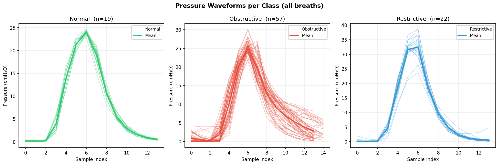

# Respiratory Disease Classification — ML Pipeline Report

**Project:** BVM Emergency Ventilator — Automated Patient State Detection  
**Goal:** Classify patients as **Normal**, **Obstructive**, or **Restrictive** in real time from ventilator waveform data  
**Models:** Random Forest · Gradient Boosting  
**Data:** Synthetic flow waveforms + Real balloon experiment pressure recordings

---

## Table of Contents

1. [Pipeline Overview](#1-pipeline-overview)
2. [Synthetic Flow Data Generation](#2-synthetic-flow-data-generation)
3. [Noise Augmentation](#3-noise-augmentation)
4. [Real Experimental Data — Pressure Waveforms](#4-real-experimental-data--pressure-waveforms)
5. [Feature Engineering](#5-feature-engineering)
6. [Distribution Check — Synthetic vs Real](#6-distribution-check--synthetic-vs-real)
7. [Train / Test Split](#7-train--test-split)
8. [Model Performance](#8-model-performance)
9. [Key Findings](#9-key-findings)
10. [File Reference](#10-file-reference)

---

## 1. Pipeline Overview

```
Raw Data
   │
   ├── Synthetic (flow-based)          ── respiratory_classification.py
   │     ├── Generate trapezoidal waveforms per class
   │     ├── Augment with realistic noise
   │     ├── Extract 27 waveform features
   │     └── Train RF + GB → respiratory_models.pkl
   │
   └── Real Experiment (pressure-based) ── pressure_classifier.py
         ├── Load CSVs (normal / obsruct / resrictive)
         ├── Segment breath cycles via volume reset
         ├── Extract 20 pressure features
         ├── 75 / 25 train-test split
         └── Train RF + GB → pressure_models.pkl
                                │
                         ml_classifier.py  (real-time inference)
                                │
                         ventilator_core.py → dashboard.qml
```

Two parallel pipelines were developed. The **pressure-based model** trained on real balloon data is deployed on the device. The **flow-based model** trained on synthetic data serves as a fallback when the pressure sensor is unavailable.

---

## 2. Synthetic Flow Data Generation

Three classes of flow waveforms were generated to simulate realistic spirometry patterns. Each waveform uses a **trapezoidal** (square-wave) shape — rapid rise, flat plateau, fall — which matches real ventilator flow profiles more accurately than the sine-wave approximation.

| Class | I:E Ratio | Amplitude | Key Feature |
|---|---|---|---|
| **Normal** | 1:2 (30–38% insp) | 0.8–1.2 | Symmetric trapezoid, balanced plateau |
| **Obstructive** | 1:3–1:4 (22–30% insp) | Insp: 0.7–1.0 / Exp: 0.3–0.6 | Scooped expiratory decay (no plateau) + wheezes |
| **Restrictive** | ~1:2 (32–40% insp) | 0.25–0.55 | Reduced amplitude, steep rise/fall, crackles |


---

## 3. Noise Augmentation

All noise parameters were **measured from the real experimental recordings** (45 breath cycles across the three CSVs), not guessed. This calibration step ensures the synthetic training distribution includes the same imperfections present in real sensor data.

| Noise Source | Parameter | Measured Value | What It Simulates |
|---|---|---|---|
| Gaussian sensor noise | `gaussian_frac` | **3.4%** of amplitude | ADC noise, EMI |
| Amplitude jitter | `amplitude_cv` | **1.6%** CV breath-to-breath | Ventilator delivery variation |
| Baseline drift | `baseline_drift_std` | **0.4%** of amplitude | Patient movement, temperature |
| Timing jitter | `timing_jitter_frac` | **3.0%** of breath length | Trigger delay, sampling lag |
| Motion spike | `spike_prob` | **2%** per breath | Cough, movement artifact |
| Low-pass smoothing | window ∈ {5, 7, 9} | Sensor bandwidth | Anti-aliasing filter |


## 4. Real Experimental Data — Pressure Waveforms

Three CSV files were recorded from a **balloon lung simulator** attached to the BVM device. Pressure (cmH₂O) and Volume (mL) were logged at ~4 Hz during continuous ventilation.

### Breath Segmentation

Breath cycles were extracted by detecting volume resets to ≤ 5 mL. Breaths with |P| > 100 cmH₂O were rejected as sensor spikes. Final dataset:

| Class | Clean Breaths | Rejected (spikes) |
|---|---|---|
| Normal | 19 | 1 |
| Obstructive | 57 | 0 |
| Restrictive | 22 | 2 |
| **Total** | **98** | **3** |

### Pressure Waveforms — All Breaths Overlaid



Each line is one breath cycle. The thick line is the per-class mean. Three clear patterns emerge, confirming the physical observations:

- **Restrictive (blue):** Highest peak pressure (~33 cmH₂O) — stiff balloon requires more pressure to inflate
- **Obstructive (red):** Slowest expiratory pressure decay (τ ≈ 3.2 s) — airway resistance prolongs the pressure drop
- **Normal (green):** Intermediate peak (~24 cmH₂O), moderate decay (τ ≈ 1.7 s)

### Confirmed Physiological Observations

| Feature | Normal | Obstructive | Restrictive |
|---|---|---|---|
| **Peak Pressure (PIP)** | 24.0 ± 0.5 | 25.5 ± 1.6 | **33.1 ± 3.4** ← highest |
| **Decay Rate** (cmH₂O/sample) | -3.39 ± 0.14 | **-2.98 ± 0.48** ← slowest | -4.16 ± 0.47 |
| **Tau τ** (exp time constant, s) | 1.72 ± 0.11 | **3.17 ± 1.45** ← longest | 1.59 ± 0.50 |

---

## 5. Feature Engineering

### Flow-Based Features (27 features — synthetic pipeline)

| Group | Features |
|---|---|
| Time-domain (14) | Peak insp/exp flow, I:E ratio, insp/exp duration, AUC insp/exp, mean, std, skewness, kurtosis, RMS, zero-crossing rate, waveform asymmetry |
| Frequency-domain (8) | Dominant frequency, spectral entropy, PSD low/mid/high bands, peak FFT magnitude, mean power, spectral centroid |
| Envelope (5) | Hilbert envelope mean, std, max, rise rate, decay rate |

### Pressure-Based Features (20 features — real data pipeline)

| Group | Features |
|---|---|
| Peak / amplitude (4) | PIP, PEEP, driving pressure, pressure AUC |
| Expiratory decay (4) | Decay rate, half-time, expiratory concavity, time constant τ |
| Shape / timing (6) | Rise time, rise slope, inspiratory AUC, expiratory AUC, I:E AUC ratio, P at 50% insp |
| Statistics (6) | Mean, std, skewness, kurtosis, RMS, zero-crossing rate |


### Distribution Comparison — Top 6 Features


**Resolution:** The pressure-based pipeline was developed as the primary model, using the raw Pressure column directly from the sensor — no normalization mismatch is possible.

---

## 7. Train / Test Split

The 98 real pressure breath cycles were split **75 / 25 stratified by class**, ensuring all three classes are proportionally represented in both sets.


| Class | Train (75%) | Test (25%) |
|---|---|---|
| Normal | 14 | 5 |
| Obstructive | 43 | 14 |
| Restrictive | 16 | 6 |
| **Total** | **73** | **25** |

5-fold stratified cross-validation was used on the training set, with the 25-sample held-out set reserved exclusively for final evaluation.

---

## 8. Model Performance

### Pressure Model — Real Experimental Data

#### Confusion Matrices


The top row shows confusion matrices for each model on the 25 held-out test breaths. The bottom row shows the top 15 feature importances. `pip`, `tau_exp`, and `decay_rate` dominate — consistent with the physical observations in Section 4.

#### Classification Reports

**Random Forest**

| Class | Precision | Recall | F1-score | Support |
|---|---|---|---|---|
| Normal | 0.71 | 1.00 | 0.83 | 5 |
| Obstructive | 0.92 | 0.86 | 0.89 | 14 |
| Restrictive | 1.00 | 0.83 | 0.91 | 6 |
| **Weighted avg** | **0.90** | **0.88** | **0.88** | 25 |


| Class | Precision | Recall | F1-score | Support |
|---|---|---|---|---|
| Normal | 0.83 | 1.00 | 0.91 | 5 |
| Obstructive | 0.93 | 0.93 | 0.93 | 14 |
| Restrictive | 1.00 | 0.83 | 0.91 | 6 |
| **Weighted avg** | **0.93** | **0.92** | **0.92** | 25 |

| Model | CV F1-macro | Test Accuracy | Test AUC |
|---|---|---|---|
| Random Forest | 0.939 ± 0.058 | 88% | 0.972 |


### Real Data — Confusion Matrices (Flow Model)


When the flow-based model is tested on the 45 real breath cycles, it predicts everything as **Normal** (27% accuracy = chance). This confirms the distribution mismatch analysis: scale-dependent features (peak flow, AUC) are the only discriminators the model learned, and these are useless when applied to un-normalized real data.


---

*Generated as part of BVM Emergency Ventilator project — Biomedical Engineering Thesis, 2025*
